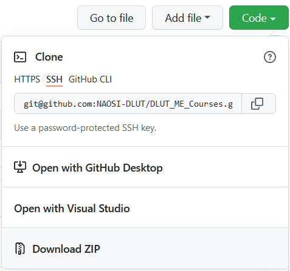

# DLUT_ME_Courses
# 大连理工大学微电子专业课程指南

对于其他文件请关注[主REPO](https://github.com/NAOSI-DLUT/DLUT_SE_Courses)

#### 欢迎贡献！！ 欢迎贡献！！ 欢迎贡献！！

## 前言1

**情报**和**资料**永远都是学业成功的重要基石，望着可爱的，接受大学摧残的新生们和学弟们（老腹黑怪了），身为学长不由生出一种母性（淦），😁  。

- 有些是学长学姐亲传的资料
- 有些是你寻找很久的电子参考书
- 有些是前人细心雕琢出的大作业，放在个人的GitHub仓库中，渐渐被遗忘；
- 有些是历年真题，前人费尽心思收集，善良的将他公开，却需要在摸索中下载
- 有些是上完一门课才恍然领悟的技巧。

我也曾很努力地收集各种课程资料，但到最后，某些重要信息的得到却往往依然是纯属偶然。这种状态时常令我感到后怕与不安。我也曾在课程结束后终于有了些许方法与总结，但这些想法无处诉说，最终只能把花费时间与精力才换来的经验耗散在了漫漫的遗忘之中。

我为这一年一年，这么多人孤军奋战的重复劳动感到不平。

本项目希望能够将这些隐晦的、不确定的、口口相传的资料和经验，变为公开的、易于获取的和大家能够共同完善、积累的共享资料。

**消除大部分你需要走的没必要的弯路，同时让大家的学业至少在资料方面是平等的**。这就是我的信念，也是我建立这个项目的原因。

——来自建立DLUT_SE_Courses学长的话

## 前言2

作为以课程数量闻名开发区校区的微电子学院，却一直没有一个能够稳定提供课程/实验/习题参考的平台（毕竟刚成立几年）。找期末习题都找不到的窘境让笔者倍感绝望。

机缘巧合下了解到隔壁软院有一个能够提供课程资料帮助的repo，于是笔者本着开发区就近互助的想法，决定依托NAOSI建立面向微电子学院的课程资料共享平台

如果有可能的话，还希望能够借助这个项目让更多微电子的同学从使用Github开始了解科创

硅农也是新时代农民工，所以用GitHub也是蛮正常的（笑）

## 上传及阅读指南1

本项目的阅读指南：

- 课程攻略：readme.md
- 电子版参考教材：ebook_ [教学年份]_[老师姓名]/（因版权产生问题，请及时issue提醒我）
- 电子版课件 ppt_ [教学年份]_[老师姓名]/
- 平时作业答案与大作业资料：hw/[学号]/ （为保证大家的隐私）
- 历年试卷和复习资料：exam/
- 笔记：note/[学号]/
- 其他请标明用处：  比如编程练习 Excersize/[学号]/

希望项目已经覆盖大多数我系的课程。

比如我是2020年上单世民老师的数据库，想上传一下老师的作业，即在数据库系统文件夹下新建文件夹`2020`，如果有双语课，则为 `2020_双语`，然后往里面填东西即可

> 当然，欢迎往对应的`readme.md`里面放自己的GitHub对应仓库链接 😚

**PS：** 由于本仓库未启用`git-lfs`，因此**请不要上传单个超过100M的文件**，否则commit无效。

同时请尽量不要上传二进制文件例如 `.exe`  ,这会为`github`带来错误

> **微电子的课程相对软院更多更乱，实验课的内容不易清晰分辨，所以上传格式可以随意，但请以文件名标清资料用途**

## 上传及阅读指南2

大多数微电子的同学应该都没有接触过Github，所以在这里尽量以最简单的思路介绍一下如何使用这个仓库

Github是一个用于存储开源项目的网站，里面每个项目都会依托一个叫Git的软件进行管理

Git是一个命令行工具，但是我们在使用Github时不需要敲命令，只需要像使用百度网盘那样即可

1. 首先需要声明：Github的服务器在国外，经常会出现进不去的情况，所以我们正准备在一个中国的开源项目托管网站**Gitee**上对这个项目做一个镜像，如果你遇到无法进入Github的情况，可以转到Gitee按照相同步骤进行操作

2. 你需要注册一个Github账号，流程和注册百度网盘一样，邮箱+密码

3. 从[官网](https://git-scm.com/downloads)下载Git软件，并按照安装程序的指示安装Git，一定注意**在安装过程中勾选里面的“将Git添加到Path”**

    

    可以参考在下面列出的其他教程对Git软件进行进一步配置

4. 随后，你需要点击右上角的Code来下载这个项目

    

    复制HTTPS选项下面的链接，切换到任意文件夹下鼠标右键打开Git命令行，输入下面的命令

    ```shell
    git clone https://github.com/NAOSI-DLUT/DLUT_ME_Courses.git
    ```

    如果你在此之前已经按照其他教程配置好了Github的SSH，可以使用SSH选项下面的链接，输入命令

    ```shell
    git clone git@github.com:NAOSI-DLUT/DLUT_ME_Courses.git
    ```

    一般来说Github使用SSH比HTTPS下载更快一些

5. 

> 更多资料可参考
>
> https://blog.csdn.net/qq_41782425/article/details/85183250
>
> https://www.cnblogs.com/ttjsndx/p/7943444.html

## 参与我们的项目

电脑前的您请不要吝啬，对于您的任何提交我们十分欢迎，您的作品一旦被合并至该仓库中，有可能会被无数学弟仰慕。我们需要您的PR！

如果你关于学校或者课程有很多疑问，请多向我们提 issue ，力所能及的范围我们都是会回答你的，但提问前请先参阅  [怎样提出一个好问题](https://github.com/ryanhanwu/How-To-Ask-Questions-The-Smart-Way/blob/master/README-zh_CN.md) 十分感谢！！

我们会尽可能将你们所提的issue整合成 Q&A ，并整理为一个文件，这项工作有待完善，欢迎大家参与！！ 😄

## 许可

由贡献者编写部分的许可如下：

[(Creative Commons BY-SA 4.0) 知识共享署名 - 相同方式共享 4.0 国际许可协议](https://creativecommons.org/licenses/by-nc-sa/4.0/deed.zh)

[The Star And Thank Author License](https://github.com/zTrix/sata-license)

真正版权归属于其各自的作者。资料仅供参考，请自己判断其适用性。

## 参考

#### [清华大学](https://github.com/Salensoft/thu-cst-cracker) 、[浙江大学](https://github.com/QSCTech/zju-icicles) 、[上海交通大学](https://github.com/c-hj/SJTU-Courses) 、[北京大学](https://github.com/lib-pku/libpku)  大家也可借鉴参阅

